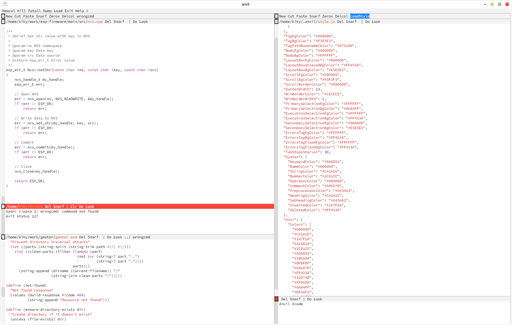

# anvil-xcode

Xcode Light Theme for [Anvil Text Editor](https://anvil-editor.net/)

## Install
1. Download the `style.js` theme file from this repository
2. Copy it to your Anvil configuration directory:
    - Linux/macOS: `~/.anvil/`
    - Windows: `%USERPROFILE%\\.anvil\`
3. Load the theme:
    - Execute the `LoadStyle` command in Anvil, or
    - Restart Anvil to apply automatically